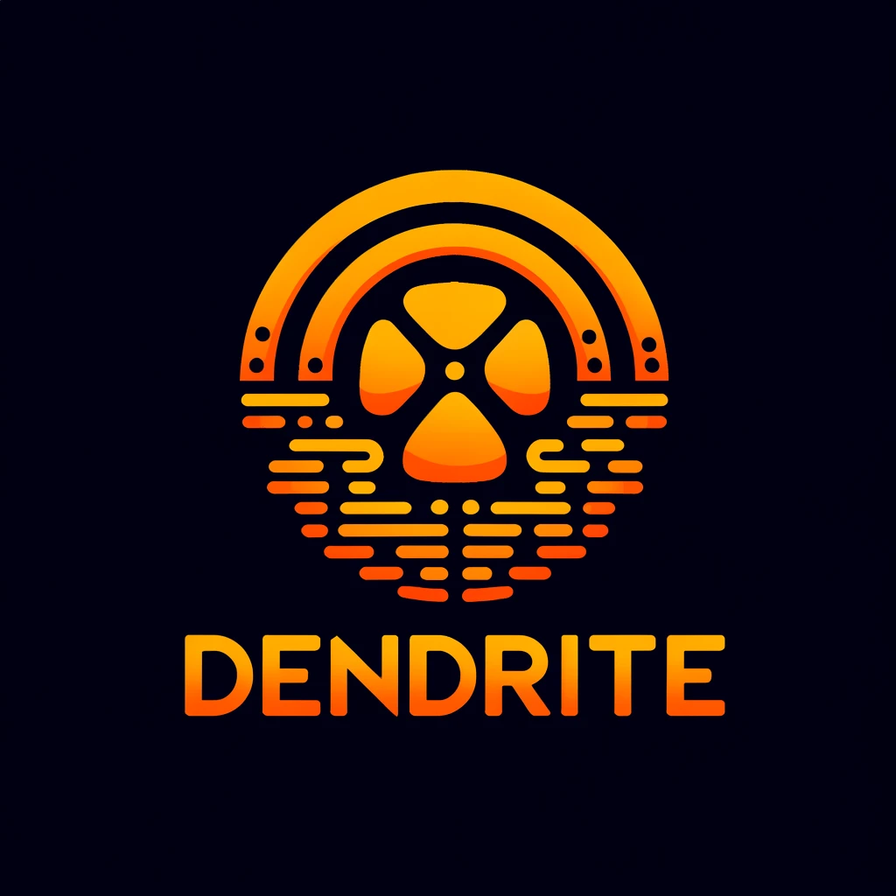

<a name="readme-top"></a>

<!-- PROJECT SHIELDS -->
[![Contributors][contributors-shield]][contributors-url]
[![Forks][forks-shield]][forks-url]
[![Stargazers][stars-shield]][stars-url]
[![Issues][issues-shield]][issues-url]
[![MIT License][license-shield]][license-url]
[![LinkedIn][linkedin-shield]][linkedin-url]

<!-- PROJECT LOGO -->
<br />
<div align="center">
  <a href="https://github.com/eneagizzarelli/DENDRITE">
    
  </a>

  <h3 align="center">DENDRITE: static equivalent of <a href="https://github.com/eneagizzarelli/SYNAPSE" style="text-decoration:none;">SYNAPSE</a></h3>

  <p align="center">
    <a href="https://github.com/eneagizzarelli/DENDRITE/issues/new?labels=bug&template=bug_report.md">Report Bug</a>
    ·
    <a href="https://github.com/eneagizzarelli/DENDRITE/issues/new?labels=enhancement&template=feature_request.md">Request Feature</a>
  </p>
</div>

<!-- TABLE OF CONTENTS -->
<details>
  <summary>Table of Contents</summary>
  <ol>
    <li><a href="#about-the-project">About the project</a></li>
    <li><a href="#installation">Installation</a></li>
    <li><a href="#usage">Usage</a></li>
    <li><a href="#license">License</a></li>
    <li><a href="#contacts">Contacts</a></li>
    <li><a href="#other-projects">Other projects</a></li>
    <li><a href="#acknowledgments">Acknowledgments</a></li>
  </ol>
</details>

<!-- ABOUT THE PROJECT -->
## About the project

**DENDRITE** is a 
- low-interaction 
- server
- static

**honeypot** entirely written in Python. It currently implements two services:
 - SSH Server
 - MySQL Server.

It works leveraging **Docker containers**. Whenever a user connects to the machine, a new container is run. It will essentially consist in a running instance of an Ubuntu image over which _MySQL server_ has been installed and populated and the file system has been enriched with arbitrary content. This enables the possibility to support **multiple sessions** for the same user. Each IP address will have its own file system for each subsequent session. Different users will never see modifications done by others.

DENDRITE has been mainly implemented with the aim of a **comparative evaluation**. It is the static equivalent of a dynamic honeypot leveraging **generative AI**: [**SYNAPSE**](https://github.com/eneagizzarelli/SYNAPSE).

<p align="right">(<a href="#readme-top">back to top</a>)</p>

## Installation

1. Clone this repository
   ```sh
   git clone https://github.com/eneagizzarelli/DENDRITE.git
   ```

2. Enter the project folder and install requirements
   ```sh
   pip install -r requirements.txt
   ```

**Note 1**: in my configuration, DENDRITE project folder has been cloned under the specific path `/home/enea/DENDRITE`. Every script/source file in this project refers to other scripts/source file using the above absolute path as a base path. If you plan to use an alternative configuration, like different location or user, remember to change the paths and to replace _enea_ everywhere.

3. Copy `configDENDRITE.sh` script from `scripts/` folder outside the `DENDRITE` directory and, after assigning the necessary permissions, run it
   ```sh
   chmod +x configDENDRITE.sh
   ./configDENDRITE.sh
   ```
    This will complete the configuration of DENDRITE, creating the necessary folders, downloading GeoLite2 database and assigning ownership and permissions to user _enea_ (or the one you specifically decided).

4. Modify your `/etc/ssh/sshd_config` file in order to disable many SSH parameters (not handled by the code) whenever user _enea_ (or the one you specifically decided) connects to your machine using SSH:
   ```sh
   Match User enea
      X11Forwarding no
      AllowTcpForwarding no
      AllowAgentForwarding no
      PermitTunnel no
      PermitOpen none
   ```

**Note 2**: if you are hosting the code on a VM like _AWS EC2_ and you want to allow password authentication, remember to change your `/etc/ssh/sshd_config.d/50-cloud-init.conf` file setting `PasswordAuthentication yes` (`60-cloudimg-settings.conf` for _Oracle Cloud Infrastructure_).

5. Restart your SSH service
   ```sh
   systemctl restart sshd
   ```

6. Install Docker
   ```sh
   apt install docker.io
   ```

7. Add user _enea_ (or the one you specifically decided) to the _docker_ group
   ```sh
   usermod -aG docker enea
   ```

8. Enter DENDRITE project folder and build the _Dockerfile_ to create an image named `dendrite-image`
   ```sh
   docker build -t dendrite-image .
   ```
   Where the dot is the location of the _Dockerfile_.

9. Modify your `/home/enea/.profile` file appending the content of `config/profile` file you can find in this project. This enables the possibility, whenever user _enea_ (or the one you specifically decided) connects to your machine using SSH, to: create/run (if not already existing) or re-start (if already existing) the Docker container, attach the user to it and extract both terminal and MySQL logs from the container itself to the local machine. In this way the user will not be able to access your machine. Its interactions with the terminal will be constrained to the container file system.

<p align="right">(<a href="#readme-top">back to top</a>)</p>

<!-- USAGE EXAMPLES -->
## Usage

Adopting the aforementioned configuration will run a DENDRITE container instead of the real file system whenever user _enea_ (or the one you specifically decided) connects to your SSH server.

<p align="right">(<a href="#readme-top">back to top</a>)</p>

<!-- LICENSE -->
## License

Distributed under the MIT License. See `LICENSE` for more information.

<p align="right">(<a href="#readme-top">back to top</a>)</p>

<!-- CONTACT -->
## Contacts

Enea Gizzarelli - eneagizzarelli2000@gmail.com

LinkedIn - https://linkedin.com/in/eneagizzarelli

<p align="right">(<a href="#readme-top">back to top</a>)</p>

<!-- OTHER PROJECTS -->
## Other projects

**SYNAPSE**: [https://github.com/eneagizzarelli/SYNAPSE](https://github.com/eneagizzarelli/SYNAPSE)

<p align="right">(<a href="#readme-top">back to top</a>)</p>

<!-- ACKNOWLEDGMENTS -->
## Acknowledgments

- [GeoLite.mmdb](https://github.com/P3TERX/GeoLite.mmdb)
- [Best-README-Template](https://github.com/othneildrew/Best-README-Template)

<p align="right">(<a href="#readme-top">back to top</a>)</p>

<!-- MARKDOWN LINKS -->
[contributors-shield]: https://img.shields.io/github/contributors/eneagizzarelli/dendrite.svg?style=for-the-badge
[contributors-url]: https://github.com/eneagizzarelli/dendrite/graphs/contributors

[forks-shield]: https://img.shields.io/github/forks/eneagizzarelli/dendrite.svg?style=for-the-badge
[forks-url]: https://github.com/eneagizzarelli/dendrite/network/members

[stars-shield]: https://img.shields.io/github/stars/eneagizzarelli/dendrite.svg?style=for-the-badge
[stars-url]: https://github.com/eneagizzarelli/dendrite/stargazers

[issues-shield]: https://img.shields.io/github/issues/eneagizzarelli/dendrite.svg?style=for-the-badge
[issues-url]: https://github.com/eneagizzarelli/dendrite/issues

[license-shield]: https://img.shields.io/github/license/eneagizzarelli/dendrite.svg?style=for-the-badge
[license-url]: https://github.com/eneagizzarelli/dendrite/blob/main/LICENSE

[linkedin-shield]: https://img.shields.io/badge/-LinkedIn-black.svg?style=for-the-badge&logo=linkedin&colorB=555
[linkedin-url]: https://linkedin.com/in/eneagizzarelli
