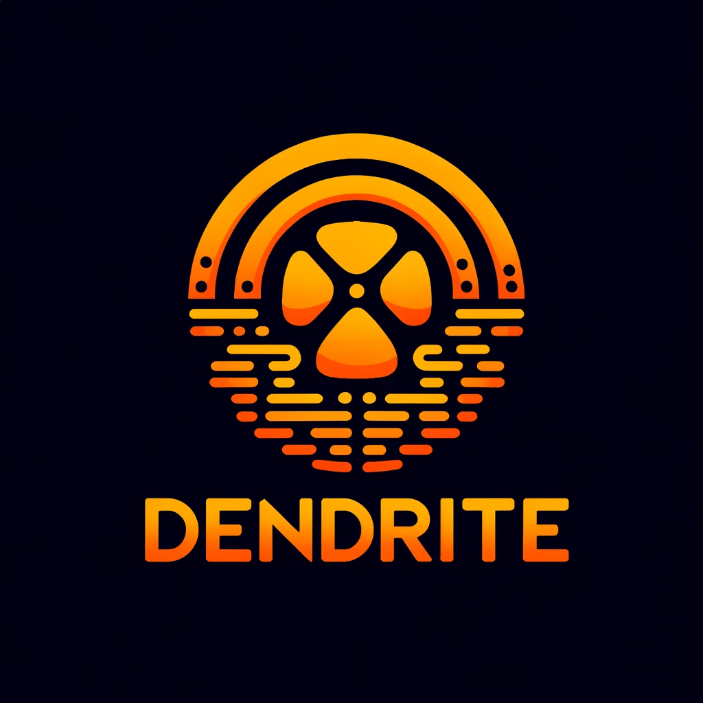

<!-- PROJECT SHIELDS -->
[![Contributors][contributors-shield]][contributors-url]
[![Forks][forks-shield]][forks-url]
[![Stargazers][stars-shield]][stars-url]
[![Issues][issues-shield]][issues-url]
[![MIT License][license-shield]][license-url]
[![LinkedIn][linkedin-shield]][linkedin-url]

<!-- PROJECT LOGO -->
 

  

  <h3 align="center">DENDRITE: static equivalent of <a href="https://github.com/eneagizzarelli/SYNAPSE" style="text-decoration:none;">SYNAPSE</a></h3>

  

    <a href="https://github.com/eneagizzarelli/DENDRITE/issues/new?labels=bug&template=bug_report.md">Report Bug</a>
    ·
    <a href="https://github.com/eneagizzarelli/DENDRITE/issues/new?labels=enhancement&template=feature_request.md">Request Feature</a>
  

<!-- TABLE OF CONTENTS -->

  
Table of Contents

  <ol>
    <li><a href="#about-the-project">About the project</a></li>
    <li><a href="#installation">Installation</a></li>
    <li><a href="#usage">Usage</a></li>
    <li><a href="#license">License</a></li>
    <li><a href="#contacts">Contact</a></li>
    <li><a href="#acknowledgments">Acknowledgments</a></li>
  </ol>

<!-- ABOUT THE PROJECT -->
## About the project

**DENDRITE** is a 
- low-interaction 
- server
- static

**honeypot** entirely written in Python. It currently implements two services:
 - SSH Server
 - MySQL Server

(<a href="#readme-top">back to top</a>)

## Installation

<!-- USAGE EXAMPLES -->
## Usage

(<a href="#readme-top">back to top</a>)

<!-- LICENSE -->
## License

Distributed under the MIT License. See `LICENSE` for more information.

(<a href="#readme-top">back to top</a>)

<!-- CONTACT -->
## Contacts

Enea Gizzarelli - eneagizzarelli2000@gmail.com

LinkedIn - https://linkedin.com/in/eneagizzarelli

(<a href="#readme-top">back to top</a>)

<!-- OTHER PROJECTS -->
## Other projects

**DENDRITE**: [https://github.com/eneagizzarelli/DENDRITE](https://github.com/eneagizzarelli/DENDRITE)

**SYNAPSE**: [https://github.com/eneagizzarelli/SYNAPSE](https://github.com/eneagizzarelli/SYNAPSE)

(<a href="#readme-top">back to top</a>)

<!-- ACKNOWLEDGMENTS -->
## Acknowledgments

- [GeoLite.mmdb](https://github.com/P3TERX/GeoLite.mmdb)
- [Best-README-Template](https://github.com/othneildrew/Best-README-Template)

(<a href="#readme-top">back to top</a>)

<!-- MARKDOWN LINKS -->
[contributors-shield]: https://img.shields.io/github/contributors/eneagizzarelli/dendrite.svg?style=for-the-badge
[contributors-url]: https://github.com/eneagizzarelli/dendrite/graphs/contributors

[forks-shield]: https://img.shields.io/github/forks/eneagizzarelli/dendrite.svg?style=for-the-badge
[forks-url]: https://github.com/eneagizzarelli/dendrite/network/members

[stars-shield]: https://img.shields.io/github/stars/eneagizzarelli/dendrite.svg?style=for-the-badge
[stars-url]: https://github.com/eneagizzarelli/dendrite/stargazers

[issues-shield]: https://img.shields.io/github/issues/eneagizzarelli/dendrite.svg?style=for-the-badge
[issues-url]: https://github.com/eneagizzarelli/dendrite/issues

[license-shield]: https://img.shields.io/github/license/eneagizzarelli/dendrite.svg?style=for-the-badge
[license-url]: https://github.com/eneagizzarelli/dendrite/blob/main/LICENSE

[linkedin-shield]: https://img.shields.io/badge/-LinkedIn-black.svg?style=for-the-badge&logo=linkedin&colorB=555
[linkedin-url]: https://linkedin.com/in/eneagizzarelli
